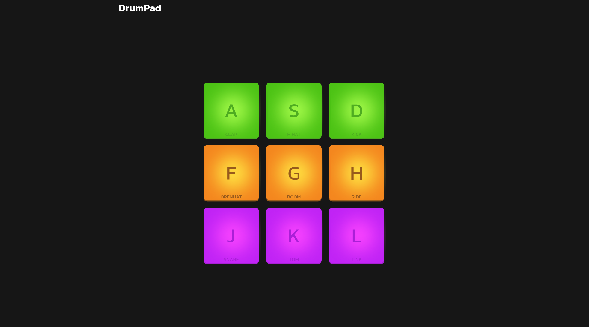

# DrumPad 🎶

##### An interactive web application — a drum machine right in your browser. This project allows you to play different drum sounds using on-screen buttons or your keyboard.

### 🚀 Features

- Playback of drum sounds (clap, kick, snare, hi-hat, etc.).
- Interactive buttons with press animation.
- Control via both keyboard and mouse/touchscreen.
- Powered by Vite for fast development and build.

### 🛠️ Used Stacks

<div style="display: flex; gap: 16px">


</div>

### ⚙️ Installation & Usage

1. Clone the repository

```BASH
git clone https://github.com/username/DrumPad-JS.git
cd DrumPad-JS
```

2. Install dependencies

```BASH
npm install
```

3. Run in development mode

```BASH
npm run dev
```

The app will be available at:
👉 http://localhost:5173

4. Build for production

```BASH
npm run build
```

5. Preview the production build

```BASH
npm run preview
```

### 🎹 Controls

Click on the pads with your mouse/tap or use keyboard keys (e.g., A, S, D, etc.).

Each pad plays a unique sound.

### 📸 Screenshots



### 📄 License

Distributed under the MIT License.
You are free to use and modify it for your own purposes.
